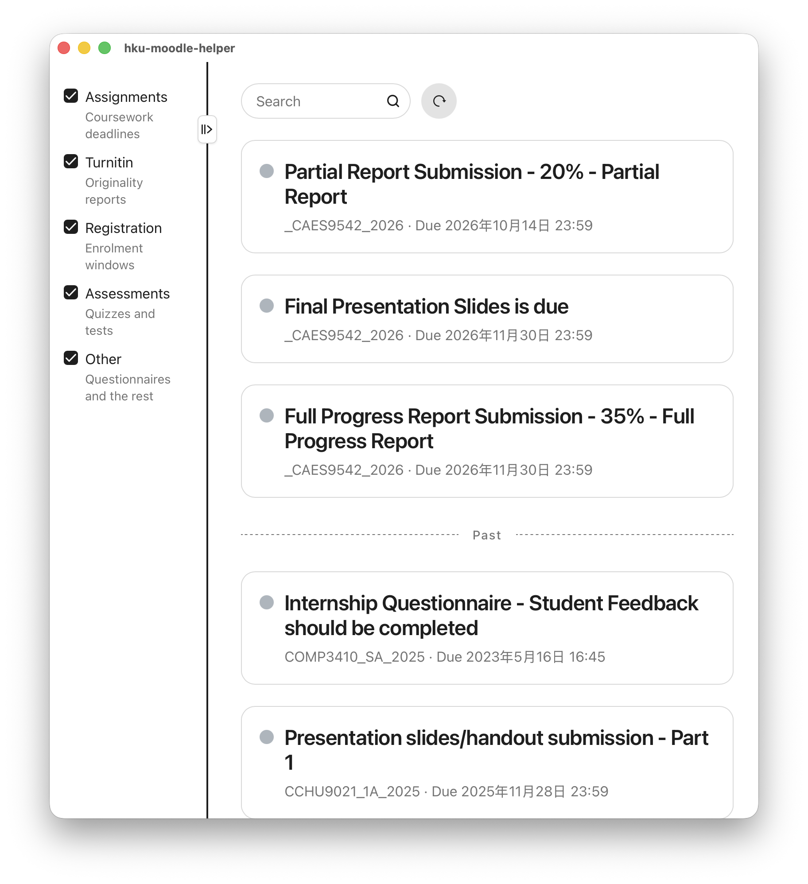

# HKU Moodle Helper

**Version 0.1.0** · A [Tauri 2](https://tauri.app) desktop app for HKU students

从 [HKU Moodle](https://moodle.hku.hk/) 拉取待办事项，方便随时查看作业、截止时间和测验，减少漏交。

[English](#english) · [中文](#中文)




---

## English

### What it is

**HKU Moodle Helper** is a lightweight **desktop app built with [Tauri](https://tauri.app)**. It signs you in through HKU Portal, then lists your Moodle to-dos in one window so you can check assignments, Turnitin, registration windows, and assessments without hunting through the website.

Closing the window does not quit the app: it stays in the **system tray** (menu bar on macOS, notification area on Windows) so you can reopen it quickly.

### Features

- HKU Portal login (including 2FA) in a dedicated window
- To-do cards with title, course, deadline, and a link back to Moodle
- Filters: Assignments, Turnitin, Registration, Assessments, Other
- Search by title or course
- System tray: show, refresh, quit
- Offline cache of the last fetched list

### Why this app exists

An older Moodle helper could inject into the website (for example to add this semester’s courses). After a Moodle update, that approach stopped working. This project is a **standalone Tauri desktop client** instead: it uses your Moodle session to fetch calendar / timeline data, with iCal as a fallback.

It is not affiliated with the University of Hong Kong.

### Download

Installers for macOS, Windows, and Linux are published on [GitHub Releases](https://github.com/Darth-S1d1ous/hku-moodle-helper/releases). Pick the build for your OS and architecture.

### Run from source

You need [Node.js](https://nodejs.org/), [pnpm](https://pnpm.io/), and [Rust](https://rustup.rs/).

```bash
pnpm install
pnpm tauri dev
```

To produce an installer:

```bash
pnpm tauri build
```

Contributor notes (architecture and checklist): [docs/implementation.md](docs/implementation.md).

---

## 中文

### 这是什么

**HKU Moodle Helper** 是一款基于 **[Tauri](https://tauri.app)** 的轻量级**桌面应用**。通过港大 Portal 登录后，会把 Moodle 上的待办集中到一个窗口里，方便查看作业、Turnitin、选课时段和测验，不必反复翻网站。

关闭窗口不会退出程序：应用会留在**系统托盘**（macOS 菜单栏、Windows 任务栏右下角），需要时再点开即可。

### 功能

- 独立窗口完成港大 Portal 登录（支持二次验证）
- 待办卡片：标题、课程、截止时间，以及跳转回 Moodle 的链接
- 筛选：作业、Turnitin、注册/选课、测验、其他
- 按标题或课程搜索
- 系统托盘：显示、刷新、退出
- 缓存最近一次拉取的待办，断网也能看

### 为什么做这个应用

旧版 Moodle Helper 依赖向网页注入脚本（例如「加入本学期课程」）。Moodle 改版后，那种方式失效了。本项目改为独立的 **Tauri 桌面客户端**：用你的 Moodle 会话拉取日历 / 时间线数据，必要时回退到 iCal。

本项目与香港大学无官方隶属关系。

### 下载

macOS、Windows、Linux 安装包发布在 [GitHub Releases](https://github.com/Darth-S1d1ous/hku-moodle-helper/releases)，按系统和芯片架构选择即可。

### 从源码运行

需要 [Node.js](https://nodejs.org/)、[pnpm](https://pnpm.io/) 和 [Rust](https://rustup.rs/)。

```bash
pnpm install
pnpm tauri dev
```

打包安装包：

```bash
pnpm tauri build
```

贡献者说明（架构与步骤清单）：[docs/implementation.md](docs/implementation.md)。
